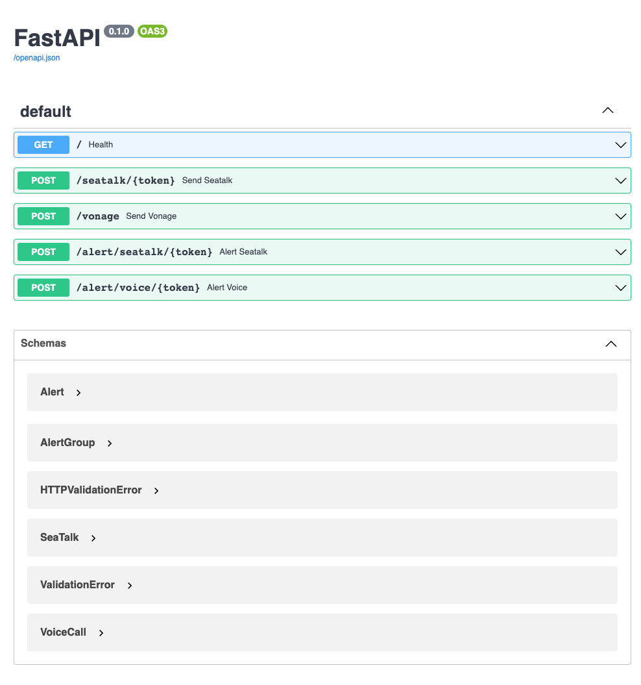
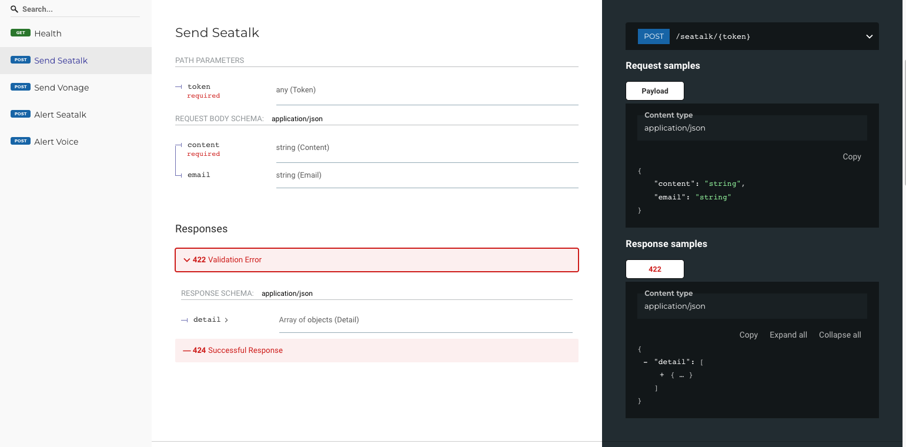

# seatalk-webhook

## Introduction
This webhook provides APIs mostly related to [SeaTalk](https://seatalk.io/) group notification based on [SeaTalk Open Platform ](https://open.seatalk.io/docs/system-account) and [Python FastAPI](https://fastapi.tiangolo.com/).

FastAPI is faster compare to Flask, and it automatically generates 2 interactive API documentation user interfaces([Swagger UI](https://swagger.io/tools/swagger-ui/) and [Redoc](https://redocly.com/)).

## Functions
1. Send *markdown* message to SeaTalk group chat
2. Prometheus/Grafana alert send to SeaTalk group chat
3. Prometheus/Grafana alert sent to both SeaTalk group chat and outbound voice call based on [Vonage](https://www.vonage.com/), this is a on-all duty feature
4. Send pure outbound voice call based on [Vonage](https://www.vonage.com/), this is not related to SeaTalk

## Dependencies
1. Voice call is based on [Vonage](https://www.vonage.com/), you need to provide credentials as environment variables
2. Prometheus/Grafana alert send to voice call is based on Google calendar API, oncall schedule is managed in Google calendar as event

## Deployment
Support both `Virtualenv` and `Docker`

### VirtualEnv Deployment
Suggest using Virtualenv for local debugging.

#### Requirements
- Install Python 3.9.6
- Install virtualenv

#### Debugging
```shell
$ cd seatalk-webhook
# activate virtualenv
$ source venv/bin/activate
$ (venv) % pip install -r requirements.txt
$ (venv) % python -m uvicorn app.main:app --reload --host 0.0.0.0
INFO:     Will watch for changes in these directories:['xxxxxxxxxxxxxxxxxxxxx'] 
INFO:     Uvicorn running on http://0.0.0.0:8000 (Press CTRL+C to quit)
INFO:     Started reloader process [19201] using WatchFiles
INFO:     Started server process [19203]
INFO:     Waiting for application startup.
INFO:     Application startup complete.
```
### Docker Deployment
1.Build docker image
```shell
cd seatalk-webhook
docker build -t seatalk-webhook:1.0 .
```

2.Prepare credential files for Google Calendar API, please follow the [Google Developer Guide](https://developers.google.com/calendar/api/quickstart/python)
```shell
ls /etc/webhook/oncall/
credentials.json private.key token.pickle
```

3.Other configurations please modify the `docker-compose.yml`, an example as below.
```yaml
version: "2.2"
services:
  webhook:
    image: seatalk-webhook:1.0
    hostname: seatalk-webhook
    container_name: seatalk-webhook
    restart: always
    ports:
      - "8000:80"
    environment:
      - agents={"Sherry":{"mobile":"6512345678","email":"sherry@sea.com"}, "Andy":{"mobile":"6523456789","email":"andy@sea.com"}}
      - dba_duty_cal=garena.com_xxxxxxxxxxxxxxxxx@group.calendar.google.com
      - vonage_application_id=xxxxxxxx-xxxx-xxxx-xxxx-xxxxxxxxxxxx
      - vonage_number=120xxxxx532
    volumes:
      - /etc/webhook/oncall:/etc/app:rw
```
- agents: agent name must match the event name in Google Calendar
  - email: used for SeaTalk group mention
  - mobile: used for voice call alert, must start with country code, eg: 65xxxxxxxx
- dba_duty_cal: google calender ID for oncall schedule
- vonage_application_id: vonage voice call application id
- vonage_number: vonage voice call number 

4.Start webhook
```shell
./start.sh
```
or
```shell
docker-compose up -d
```

## API docs
### Swagger UI
http://127.0.0.1:8000/docs



### Redoc
http://127.0.0.1:8000/redoc


## Test FastAPI Endpoints
You can use test_main.http